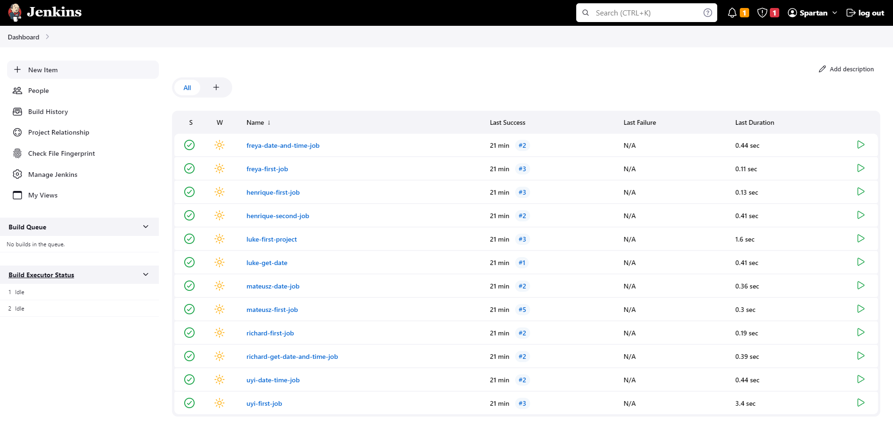
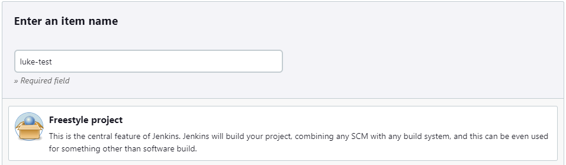
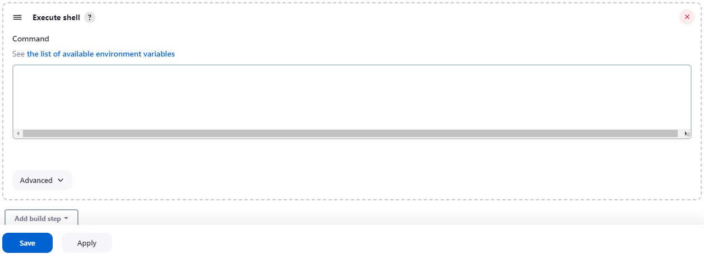

# CI/CD

CI - the point of CI is to constantly integrate changes to the main branch but make sure that it is tested automatically first.

CD - due to features being deployed consistently, the end user needs to agree to a culture of fast feedback to report incorrect functionality or bugs.

Steps to CI/CD
1. push changes to dev branch
2. CI will automatically test and build the code.
3. github sends a webhook to let jenkins know that there has been an update.
4. Jenkins master node creates an agent node
5. Agent node builds and tests changes.
6. If successful, merge code to main.
7. Agent node uses SSH key to access EC2 instance to deploy code.

Jenkins main dashboard. Here you can view all current projects.

Jenkins create project screen. Here you can create a new project / pipeline. Give it a reasonable name and for our case we used a freestyle project.

This is the build step process. Click execute shell command and in the box, type whatever commands the jenkins server should execute when building the project. For nodeJS projects you can select the node.js option and run the node.js goals such as test or build.

