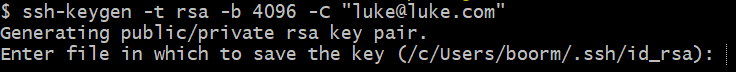

# SSH

Creating SSH keys to use with github to improve security.

cd into .ssh folder

`ssh-keygen -t rsa -b 4096 -C "luke@testingemail.com"`

Make sure to give the key an appropriate name for the use-case, in this case we are using github so the name is
luke-github-key.

Add the .pub version of the key to the github key page on the ssh tab.

eval {backtick}ssh-agent -s{backtick}

ssh-add "key name"   --Add the key to make it usable

ssh -T github@github.com    --Test the ssh connection to github endpoint

When creating remote endpoints in our local repos, use the SSH version of the command instead of the HTTPS version.