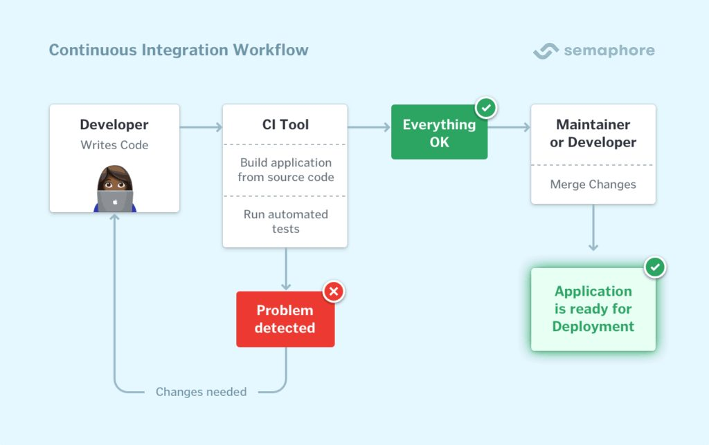

# CI/CD and Jenkins

CI - continuous integration, code changes from multiple contributors are automatically integrated into the shared repo several times per day, should address integration issues early in development

CD - Continuous deployment. Automatically and consistently delivering software to a testing environment after every successful build. The software should be ready for deployment in the constant delivery phase. 

CDE - Continuous deployment takes it a step further and does not require a manual decision as to whether or not to deploy the software build.

Jenkins - open-source automation server widely used for: building, testing, and deploying software. It facilitates CI/CD. Automatically builds and tests the code. The software will be prepared for deployment to a staging/production environment.
  Benefits:
  1. remove human error from building and testing
  2. flexibility - supports variety of version control systems, build tools and testing frameworks.
  3. Monitoring - provides a representation of CI/CD workflows.
  4. Distribution of build and test - can distribute workload accross multiple machines to reduce build times.
  5. Community support
  Disadvantages:
  1. Complexity and big learning curve
  2. Maintenance overhead
  3. Limited user interface
  4. resource utilisation
  5. security concerns
  6. single point of failure if there is only one jenkins server

Stages of Jenkins
1. Checkout - retrieve source code
2. Build - compile source code
3. Test - execute automated tests
4. Static code analysis = analyse code for potential issues
5. code review - facilitate human code reviews
6. Artifact archiving - store executable artifacts for future reference
7. Deploy (optional) - deploy the application to a staging environment
8. Post Deployment testing (optional) - run additional tests or checks after deployment to ensure application behaves correctly in the target environment

Alternatives
1. Gitlab CI/CD
2. Travis CI
3. Circle CI
4. TeamCity
5. Bamboo
6. Azure devops services
7. GoCD
8. Drone
9. BuildKite

Business reasons
1. Faster time to market
2. improved code quality
3. reduce manual effort
4. consistent repeatable process
5. increased collaboration and communication
6. rapid feedback loop
7. scalability and flexibility
8. ris reduction
   
