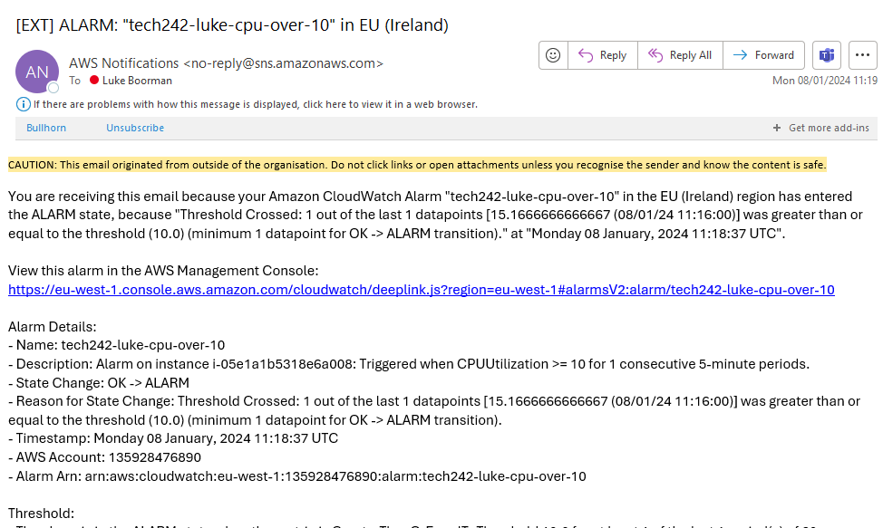
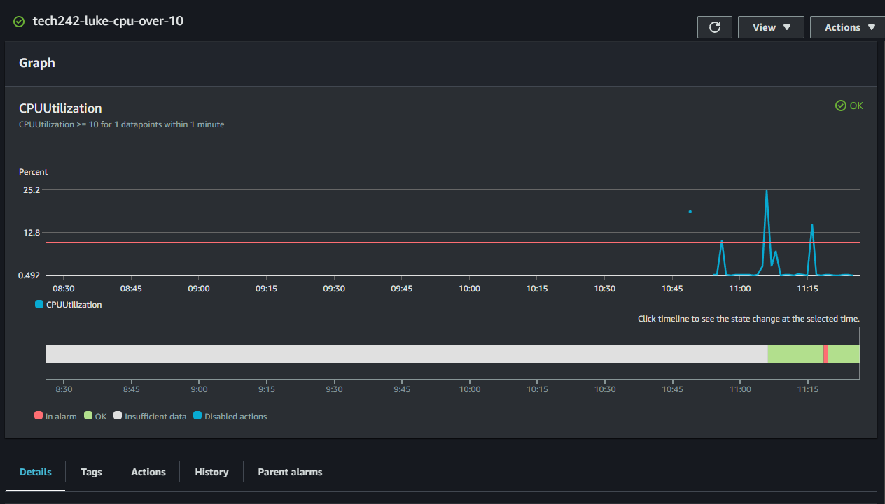

# Alarms

When creating an alarm, you can create it from within the instance or from within the cloudwatch panel. Make sure to set up the correct email address and make the period 1 minute if you have enabled detailed monitoring.

 - 

Below is the dashboard for the alarm, you can see that the CPU utilisation goes above the alarm threshold.
 - 