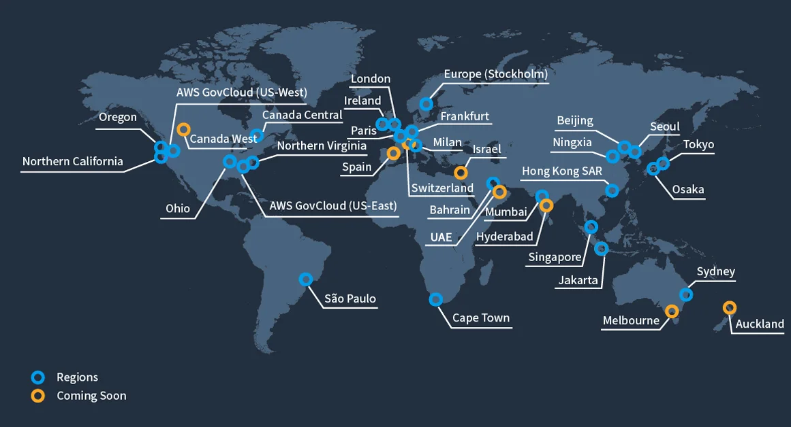

# AWS basics

## Core services
- Compute services
  - can run code in virtual environments for testing
- Storage services
- Database services
- Networking

## Security
- Provides access management
- provides key management

## Monitoring and management
- monitor resources and collect metrics
- record API calls.

## Deployment and Automation
- Can provision resources
- manage applications without dealing with infrastructure

## Dev tools
- Manage repos
- build and test code in cloud
- automate app deployment

## Global Reach
- Centers located around the world, allows users to deploy apps globally.

## Locations
  
Has locations around the globe, allowing for fast access times no matter the user's location.

## Points of Presence
Optimise performance, reduce latency and enchance the availability of AWs services for end-users.

### Edge locations
Distributed in major cities strategically.