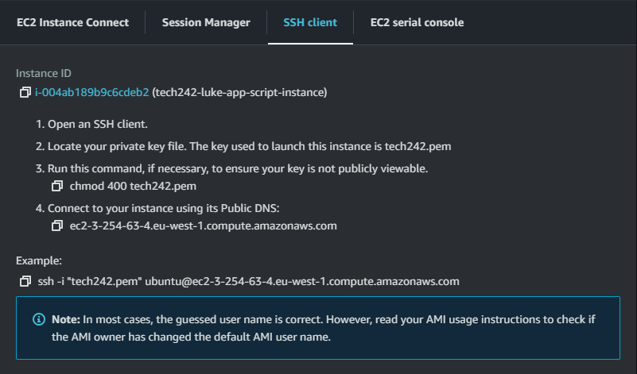
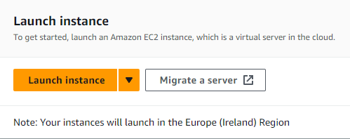
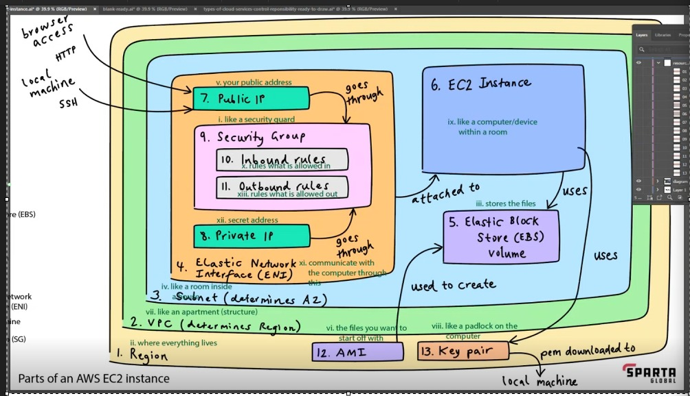

# EC2 Instances

Virtual machine instances on AWS.

## Architecture of EC2

We have our own virtual network on a public cloud.

 - Public IP - your public address
 - Private IP - a secret address, only used for devices inside the network
 - Inbound SG rules - rules what is allowed in to the network
 - Security group 
 - Outbound SG rules - rules what is allowed out of the network
 - Region - geographically, closest is Ireland
 - Virtual Machine - like a computer / device in the cloud.
 - Virtual private cloud - determines the region to be used
 - Elastic block store volume - stores the files
 - EC2 instance - Essentially a virtual machine.
 - Key-pair - like a padlock
 - Subnet - breaks the network into chunks
 - Elastic network interface - communicate with the computer
 - AMI ( Amazon machine image ) - set of files including an OS. The files to start with.

AMI -ubuntu/images/hvm-ssd/ubuntu-bionic-18.04-amd64-server-20230424 ami-0a7493ba2bc35c1e9

Search for 20230424 choose the one with code ami-0a7493ba2bc35c1e9

## Creating virtual machine

1. Go to aws dashboard
2. click EC2
3. click create instance
4. make sure region is on ireland
5. set security group to tech242
6. name it something reasonable (tech242-luke-??)
7. Pick the AMI listed above
8. change permissions of the .pem file
9. ssh into the vm using the .pem credentials.
   1.  `ssh ".ssh/tech242.pem" user@host`

 

 

 

