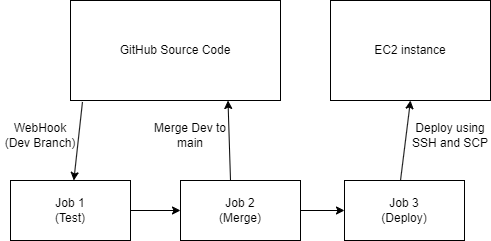
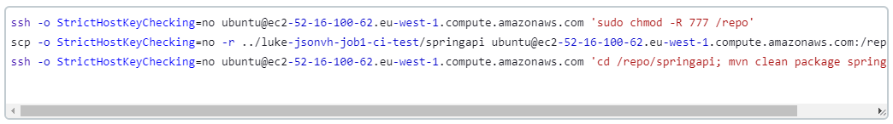

# Jenkins Pipeline

# CI job 1 - Testing

This job will essentially check whether there is any updates to the repo given to jenkins at the given branch.

We also have to add the credentials as you can see from the screenshot. This is just our private key coresponding to the public key already set up in the github repo.

Executing top level maven goals allows us to choose which maven goals to execute, in this case we are using package to reload the app and then execute the tests.

# CI Job 2 - merging

Source code management - additional properties, merge before build, repo name origin, branch name main.

Post build actions - Git Publisher, tick push if success, and merge results.

Make sure to trigger Job3 from the post-build actions after merging to Github.

## Blockers in Job 2
1. GitPublisher was confusing at first, however, after some research the job was easy to complete.

# CD Job 3 - deploying

Set up the .pem file in the SSH agent section.

Select the .pem file.

in the build steps, use the commands below to get the source code from the previous jobs.

## Blockers in Job 3

1. No permissions: When trying to SCP files, permission denied errors were thrown, this was resolved by adding the chmod command as given above.
2. SCP did not work when using -f flag to force overwrite, removing it seemed to function as intended.