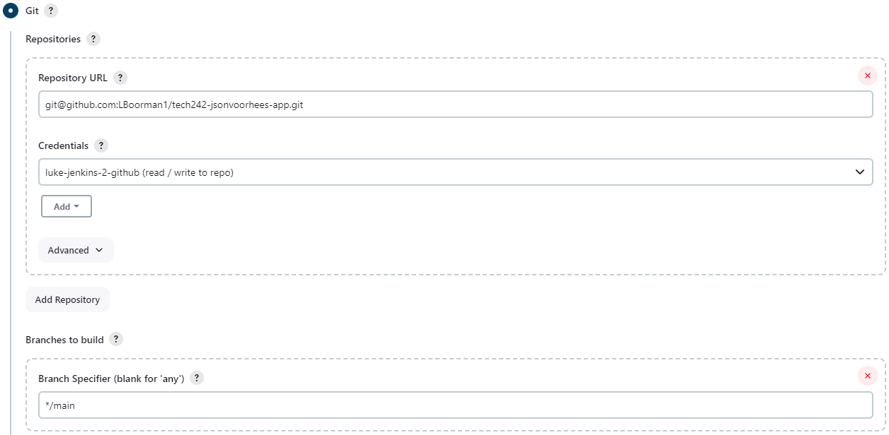
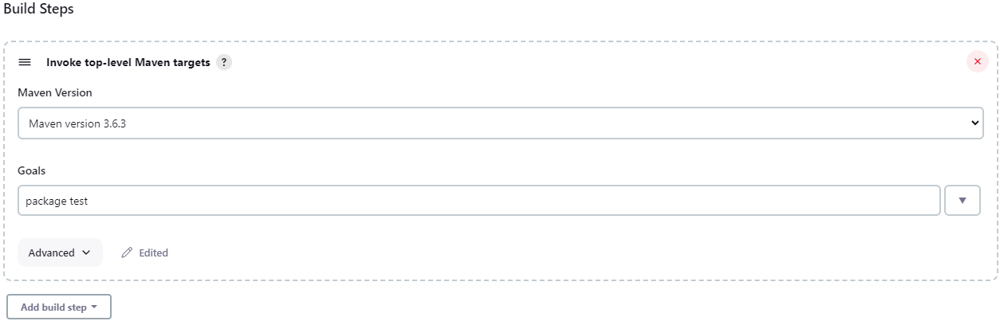

# CI job

This job will essentially check whether there is any updates to the repo given to jenkins at the given branch.

We also have to add the credentials as you can see from the screenshot. This is just our private key coresponding to the public key already set up in the github repo.

Executing top level maven goals allows us to choose which maven goals to execute, in this case we are using package to reload the app and then execute the tests.

# CI Job 2 - merging

Source code management - additional properties, merge before build, repo name origin, branch name main.

Post build actions - Git Publisher, tick push if success, and merge results.