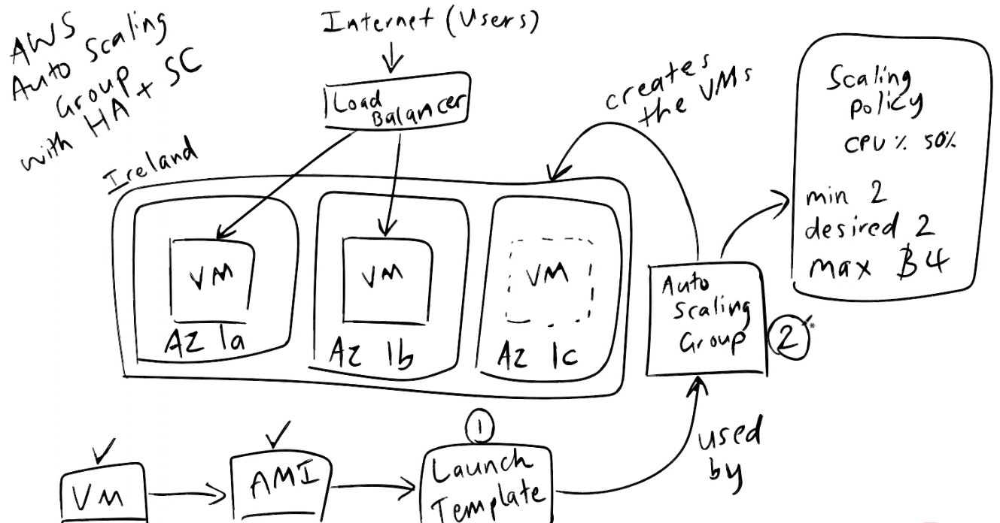
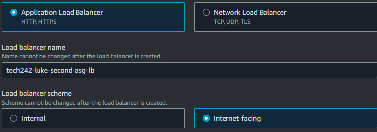

# Auto Scaling

Launch templates allow for adding security groups, user data and key-pair automatically for any future further VMs.

Need to give auto-scaling a policy
 - Average CPU utilisation.
 - Min = 2
 - Desired = 2
 - Max = 3

To achieve high availability, make sure each VM goes into a different availability zone.

Create launch template using your ami. Launch template will allow you to add the security group, key pair and user data to run scripts.

After creating launch template, go to auto scaling groups. Auto scaling groups will need to take your launch template. They will also need subnets that they can access, these will also determine the availability zones. 

There are 7 stages. Most of these do not need to be touched, however, we need to create a load balancer which has a minimum, maximum and desired number of virtual machines. We need to create a target group, this is where the instances will be created so that they can be identified as created by the auto-scaler. The load balancer also needs to be internet facing. Also make sure to turn on elastic load balancing health checks. Make sure to track the CPU average utilisation. For the instance maintenance policy (new feature), select prioritise availability.

## Deleting

When deleting auto-scaling groups. Delete the load balancer first, then target group, then auto-scaling group. This will prevent the auto scaling group from keeping two instance active at all times.