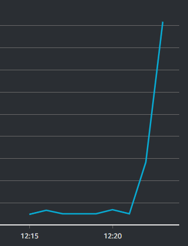

# Monitoring

Helps keep up with the amount of traffic by providing detailed stats.

AWS - cloudwatch provides monitoring (CPU load)

Go to monitoring, click detailed monitoring, enable.
    Allows the interval at which monitoring takes place to be shortened to 1 minute instead of 5.

Add the useful charts to dashboard. 

Can change the axis of the graph to see more detailed data.

refresh app a few times to see the spike in the graph.

## Benefits

Allows the creation of alarms and automatic load balancing. Without monitoring, there is no way of telling the load that your virtual machine is under and it can fall over

[Auto-Scaling](Auto-Scaling.md)