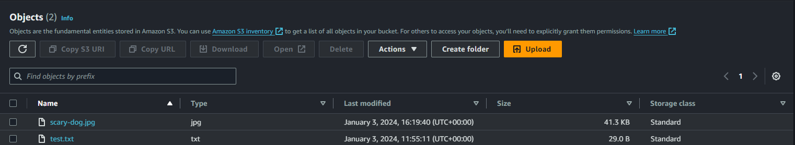

# S3 Storage

Object storageon cloud, blob storage. Buckets are groups of files. Can store large amounts of data on the cloud storage and will be able to use the media files programatically.

Each file has a URL by which it can be accessed if it is made publicly accssible.

## STEPS

sudo apt install awscli -y
aws --version

aws configure
(paste in access keys)

default region: eu-west-1
default output format: json

aws s3 help
aws s3 ls

aws s3 mb s3://(bucket-name) -- makes a bucket

aws s3 cp (filename) s3://(bucket name) -- uploads a file to bucket
aws s3 sync s3://(bucket-name) directory -- download bucket files
aws s3 rm s3://(bucket-name)/(file-name) -- remove specified file
aws s3 rm s3://(bucket-name) --recursive -- remove all files in bucket
aws s3 rb s3://(bucket-name) -- delete the bucket

[Script for changing home.html](script.md)