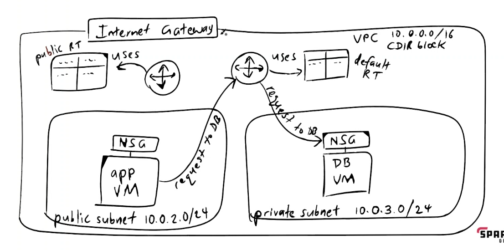
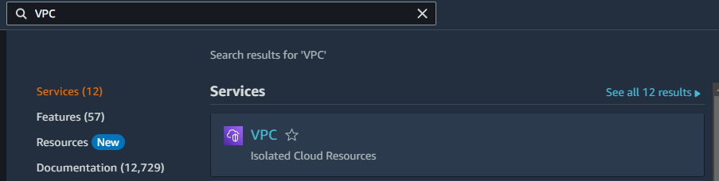
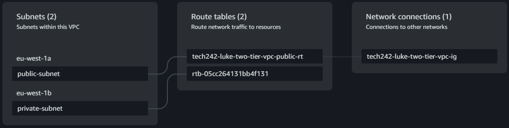

# VPC

A public cloud is like an apartment building, a VPC is like a floor with a few rooms, rooms are like subnets.
Each subnet is associated with an availability zone.

CDIR block, IP address range. 0.0.0.0/16 - 16 means first two8 bit numbers are locked. Subnets share common parts of IP address.

Public and priavte subnets are different, private subnet cannot access the internet. Database VM should not access the internet. Therefore it does not need a public IP address.

## Steps

1. Create VPC
2. Create each of the subnets
3. Create internet gateway
   1. attach it to vpc
4. Create public router and route table
   1. associate public route table with public subnet
   2. associate public route table with the internet gateway
5. Configure route table
6. Create database VM
7. Create app VM
   

Security groups need to be in the same VPC as your subnets.

Using a remote machine to access another vm using the private ip address is called a jump box.

Can use the resource map to check connections for subnets and the network connections.

The internet gateway allows the public subnet to be accessed from anywhere, this allows HTTP connections.

The public route table needs to connect the internet gateway to the public subnet.